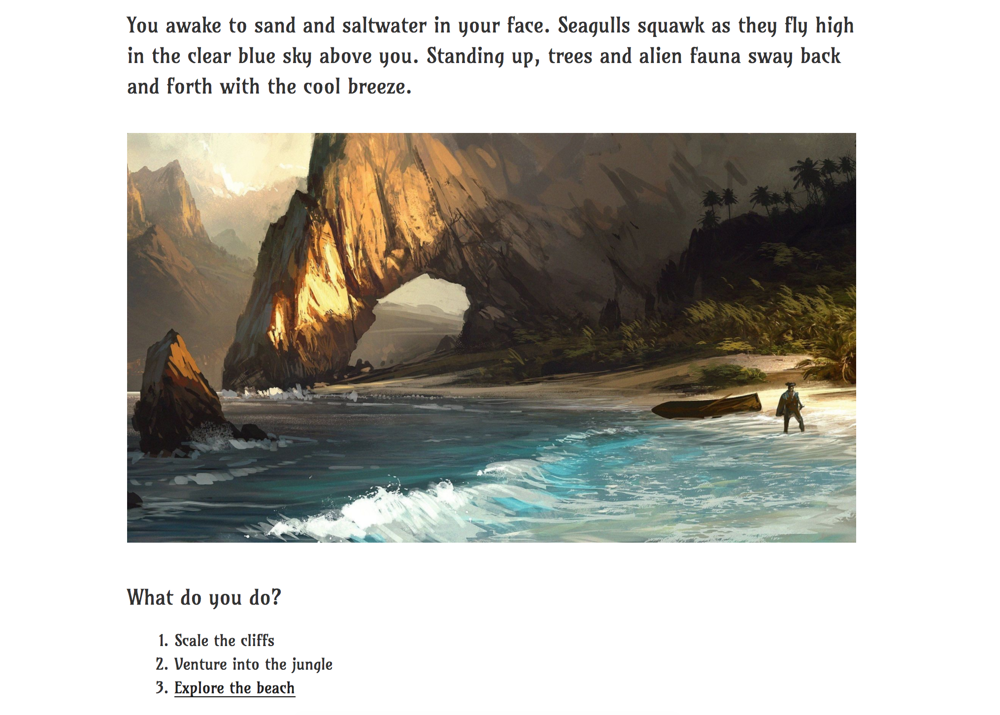

# ARTEMIS

A backend REST API that serves as a game engine for "choose your own adventure" type story games.

The intent is to have a CMS (WordPress) to handle the front end while the backend API
provides enforcement of game logic. Included within this repo is a WordPress plugin which interfaces
with the API.

Your frontend does not have to be WordPress. The selling point of this engine is to liberate you to
using whatever system or tools that you want to use for your frontend. Code your game as a Desktop
App in Java or use Unity instead, your restrictions are being able to make HTTP requests and
following the Artemis paradigm.

# INSTALLATION

TBD

# ARCHITECURE OVERVIEW

The backend takes a MVC approach hence this section being organized accordingly so.

## View

### cgi-bin/artemis

Utilizes the Mojolicious framework, this handles and routes HTTP requests to the controller layer (Artemis modules)

## Controller

Perl modules by the way which interface with the Model.

### Artemis::Action

Represents "doing" something in the gameworld. Often composed of conditions and operations. When you _execute_ an action,
The conditions are first evaluated; If they return true then the operations manipulate the game in some way, otherwise
an error is thrown. Some example actions are "EnterSymposium", "Move", "Cast", "Damage".

### Artemis::Board

Extends [Games::Board](http://search.cpan.org/~rjbs/Games-Board/lib/Games/Board.pm) CPAN Module; This module handles
the locations of Entites on a "world" board or combat boards (more broadly reffered to as symposiums).

### Artemis::Entity

A person, place, or thing that is in existance within the game world we are making.

### Artemis::Matriarch

The background director that automates similiar to a game master. Does this by making requests in the Symposium queue.

### Artemis::Symposium

A queue manger for turn-based events such as combat. Handles requests and executes them.

## Artemis::Model

A unified interface for multiple storage drivers

### Artemis::StorageDriver::MySQL

TODO

### Artemis::StorageDriver::File

TODO

## Client

### wp-content/plugins/artemis.php

Plugin allowing WordPress to integrate with the Artemis API. Wordpress will be handling presentation
along with user management and authentication.

FrontEnd WordPress Screenshot

# EXAMPLES

As of April 9, 2017, much of Artemis' functionality is still in development when this section was written.

In the curl examples, assume _localhost_ as the address which Artemis is running at.

## Character

This section pertains to character manipulation

### Create

    curl -X POST localhost/cgi-bin/artemis/character

Returns the newly created CharacterId

### Retrieve

    curl localhost/cgi-bin/artemis/character/:CharacterId

Returns stats and other information for given CharacterId

### Update

Resources to update the character

#### Move

    curl -X PUT localhost/cgi-bin/artemis/character/:CharacterId/location/:LocationId

Moves a character to a new location. Restraints are that the previous location has been listed as valid
within the new location. If attempting an illegal move then an error occurs.

